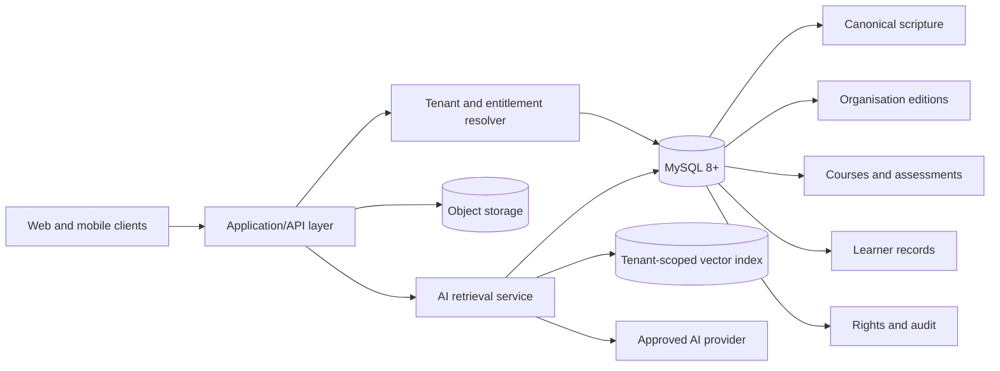
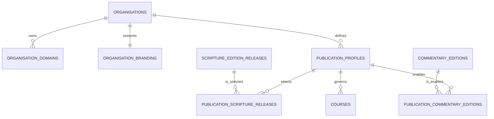
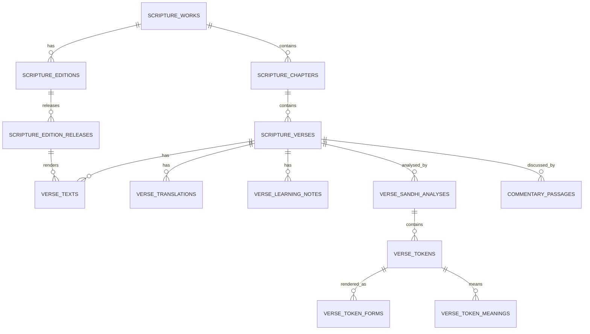
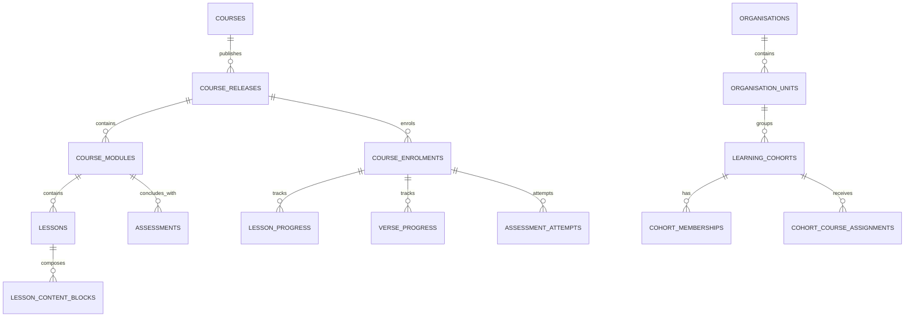

# Living Bliss Digital Library

## Complete Database Architecture and Data Design

**Status:** Implementation-ready future-state design
**Version:** 1.0
**Date:** 3 September 2026
**Primary database:** MySQL 8+ with `utf8mb4`
**Application mapping:** Drizzle ORM

---

## 1. Executive summary

This design provides the complete relational foundation for the Living Bliss Digital Library and Bhagavad Gita learning platform. It supports:

- the canonical structure of the Bhagavad Gita and, later, other sacred works;
- Sanskrit in multiple scripts, including Devanagari, Odia and Roman transliteration;
- Sandhi-vicheda, ordered words, script-specific word forms and multilingual word meanings;
- translations and scene/context notes in the learner’s selected language;
- selectable bhāṣya from multiple commentators and gurus;
- a different approved scripture edition and commentary set for each organisation;
- reusable courses, foundation modules, verse lessons and chapter assessments;
- individual learners, schools, classes, cohorts, teachers and organisation administrators;
- cross-device progress, bookmarks, private notes, achievements and certificates;
- governed media such as recitation audio, video, captions, transcripts and downloads;
- rights, sources, editorial review, publication releases and audit history; and
- a tenant-isolated, citation-first data layer for future AI study tools.

The principal architectural decision is to keep the **canonical scripture reference**, **organisation-approved publication**, **curriculum**, and **learner record** separate. An ISKCON, Chinmaya Mission, BAPS, Living Bliss, school or government deployment may therefore use the same platform while selecting its own authorised editions, translations, commentaries, branding, curriculum release and AI policy.

The design is additive. It does not remove the current authentication tables or disrupt the working prototype. The existing `learner_states` table remains temporarily as a compatibility projection while the application is migrated to normalized enrolment and progress tables.

---

## 2. Data-platform topology

| Data class | System of record | Reason |
|---|---|---|
| Users, organisations, scripture metadata, courses, assessments and progress | MySQL 8+ | Transactions, foreign keys, filtering, reporting and consistency |
| Scripture, translation, word meaning and commentary text | MySQL 8+ | Structured multilingual retrieval and version control |
| Images, audio, video, PDFs, captions and exports | S3-compatible object storage | Large binary objects should not be stored in MySQL |
| File ownership, rights, checksums and attachment metadata | MySQL `media_assets` tables | Searchability, access control and provenance |
| AI retrieval chunks and citation metadata | MySQL | Authoritative scope, version, rights and retraction state |
| Embeddings and semantic search | Tenant-partitioned vector index | Efficient similarity search; MySQL stores only the external index reference |
| Secrets, API keys and encryption keys | Deployment secret manager | Secrets must never be stored in content or configuration tables |

### 2.1 Logical architecture



---

## 3. Design principles

1. **Canonical identity is global; interpretation is versioned.** Bhagavad Gita 2.47 has one stable verse identity. Its script renderings, translations, analyses and commentaries belong to explicit edition releases.
2. **Every organisation is isolated.** Organisation context is resolved from a trusted domain, invitation or authenticated membership. Client-supplied organisation identifiers are never trusted by themselves.
3. **Language and script are different dimensions.** Sanskrit may be rendered in Devanagari, Odia or Latin script. A learner’s interface language is independent of the Sanskrit script representation.
4. **Published content is immutable.** Changes create a new release. A published release can be superseded or retracted, but not silently rewritten.
5. **Rights and provenance travel with content.** Source, licence, authority, release and editorial status are available for every production publication.
6. **Curriculum composes governed content.** Lessons reference scripture, analysis, translation, commentary and media records rather than copying them into page-specific blobs.
7. **Progress is normalized and auditable.** Enrolment, lesson progress, verse progress and assessment attempts are separate records, not a JSON array on a user profile.
8. **Private learner text is encrypted.** Notes, free-text answers and any retained AI messages are encrypted at the application boundary.
9. **AI is never authoritative for scripture.** AI retrieves approved, rights-cleared sources and returns citations. It cannot create or modify canonical content.
10. **Prototype records cannot appear as approved production content.** `draft`, `prototype`, `published`, `superseded` and `retracted` states are explicit.

---

## 4. Core tenancy and publication model

An organisation does not receive a copy of the whole database. It receives an organisation record, branding, domains, membership roles and one or more publication profiles. A publication profile selects the scripture release and commentary editions that its audience may use.



### 4.1 Resolution sequence

1. Resolve `organisation_id` from a verified hostname or authenticated invitation.
2. Resolve the active `publication_profile` for the requested course and audience.
3. Resolve the profile’s approved `scripture_edition_release` for the Bhagavad Gita.
4. Resolve the learner’s selected interface language and Sanskrit script.
5. Load the verse, script rendering, Sandhi analysis, word forms, word meanings, translation and scene note from that release.
6. Load only commentary editions enabled by the publication profile and matching the selected language.
7. Enforce content status, rights, entitlement and age policy before returning data.

This is the mechanism that permits different organisations to use different Gita editions and guru translations without changing the application code.

---

## 5. Scripture and lesson-content model



### 5.1 How Bhagavad Gita 2.47 is represented

- `scripture_verses` supplies the stable identity `2.47`.
- `verse_texts` supplies Sanskrit in Devanagari, Sanskrit in Odia script and IAST transliteration.
- `verse_sandhi_analyses` identifies an approved Sandhi-vicheda analysis for a particular scripture release.
- `verse_tokens` preserves the exact word order.
- `verse_token_forms` gives the same word in Devanagari, Odia and Latin scripts.
- `verse_token_meanings` supplies the word meaning in English, Hindi, Odia or any other supported language.
- `verse_translations` supplies one or more named translations per language.
- `verse_learning_notes` supplies the scene/context, key idea, pronunciation guidance or other approved learning layer.
- `commentary_passages` supplies a full passage or editorial summary for a selected guru and verse.
- `media_attachments` may attach recorded recitation, pronunciation audio or video. Browser speech synthesis remains a presentation feature, not the canonical audio record.

### 5.2 Unicode rules

- The database default character set must be `utf8mb4`.
- All incoming text should be normalized to Unicode NFC before comparison, checksumming or publication.
- Canonical content checksums are calculated after normalization and line-break normalization.
- Transliteration is stored as text, not generated on demand for published editions.
- Language uses BCP 47-compatible codes (`en`, `hi`, `or`, `sa`); script uses ISO 15924 codes (`Latn`, `Deva`, `Orya`).

---

## 6. Bhāṣya and guru model

`persons` represents the commentator; `commentary_traditions` represents the philosophical tradition; `commentary_works` represents the historical work; `commentary_editions` represents an organisation-approved language/version; and `commentary_passages` contains the verse-linked content.

The separation is essential because:

- the same commentator may have multiple translations;
- an organisation may approve one translation and not another;
- one edition may contain the full bhāṣya while another contains a scholar-approved learner summary;
- the rights holder, source, version and publication status may differ by language; and
- a publication profile can choose the exact gurus and display order available to its users.

Prototype summaries are explicitly marked `draft`/`prototype`. They must not be relabelled as a guru’s verbatim words.

---

## 7. Curriculum, learning and schools



### 7.1 Course structure

- A `course` is the long-lived product identity.
- A `course_release` is the immutable curriculum version assigned to learners.
- A `course_module` may be a foundation module, scripture chapter, bridge unit or enrichment unit.
- A `lesson` may be a verse study, background lesson, video lesson, reflection or practice.
- A `lesson_content_block` orders reusable content elements on the lesson page.
- `lesson_prerequisites` controls sequencing without hard-coding it in the user interface.
- An `assessment` belongs at course or module level. For the current requirement it is linked to the chapter module, not to each verse.

### 7.2 School and institutional use

- `organisation_units` represents school groups, campuses, departments, grades or classes.
- `learning_cohorts` represents a teaching group for an academic period.
- `cohort_memberships` assigns learners and facilitators.
- `cohort_course_assignments` assigns a specific immutable course release and due date.
- `course_enrolments` remains the learner’s authoritative course record.
- The same user may belong to several organisations but receives a separate enrolment and policy context in each.

The model intentionally avoids embedding a particular national curriculum standard. Curriculum mappings can be added as a separate bounded module once the relevant government framework and licensing terms are known.

---

## 8. Assessment and credentials

Assessments support single-choice, multiple-choice, matching, ordering and reviewed free-text questions through `question_type` and structured configuration. Prompts, options, feedback and instructions are localized independently.

Key controls:

- the server checks lesson prerequisites before opening a chapter assessment;
- an attempt is fixed to the assessment and course release used at the time;
- correct answers are never returned to the client before submission;
- free-text responses are encrypted;
- every attempt stores raw points, possible points, percentage and pass state;
- certificates contain an immutable snapshot of the learner name, course title, release and completion evidence; and
- certificate verification uses a hashed code and supports revocation.

---

## 9. AI-ready data architecture

```mermaid
flowchart LR
    Question[User question] --> Context[Trusted organisation, course, edition and language]
    Context --> Policy[AI policy and age/safety check]
    Policy --> Sources[Approved knowledge sources]
    Sources --> Chunks[Rights-cleared knowledge chunks]
    Chunks --> Retrieve[Hybrid retrieval]
    Retrieve --> Answer[Retrieval-only or approved model]
    Answer --> Verify[Citation and policy verification]
    Verify --> Response[Answer with sources and limitations]
```



### 9.1 Tables

- `ai_policies` controls response mode, enabled state, age threshold, allowed categories, retention and provider reference per organisation/course release.
- `ai_knowledge_sources` connects AI retrieval to a specific entity, edition, language, version, rights state and checksum.
- `ai_knowledge_chunks` stores bounded text passages and the external vector-index reference.
- `ai_conversations` and `ai_messages` are optional. They remain empty when policy does not permit retention.
- `ai_message_citations` proves which approved chunks supported a response.
- `ai_feedback` stores encrypted, purpose-limited learner feedback.

### 9.2 Non-negotiable controls

- No cross-tenant retrieval.
- No unpublished, superseded, retracted or rights-blocked source.
- No model-generated scripture, translation or bhāṣya presented as authoritative.
- No credentials or provider secrets in database rows.
- Conversation storage off by default.
- Child data, private notes and free-text reflections excluded from model context unless separately approved with explicit purpose and consent.
- Retraction must remove the source from the retrieval index and cache.
- Every generated factual explanation must carry citations or be refused as ungrounded.

---

## 10. Complete table catalogue

The schema contains the existing authentication layer plus 78 new product-domain tables.

### 10.1 Existing identity and compatibility tables

| Table | Purpose |
|---|---|
| `auth_users` | Account identity and password reference |
| `auth_identities` | Google, Microsoft and other OIDC identities |
| `auth_sessions` | Hashed opaque sessions |
| `auth_challenges` | Hashed, single-use OTP challenges |
| `auth_oidc_transactions` | Short-lived encrypted OIDC state |
| `auth_rate_limits` | Authentication abuse controls |
| `learner_states` | Temporary compatibility projection for the current prototype |

### 10.2 Reference and tenancy

| Table | Purpose |
|---|---|
| `languages` | Supported content/interface languages |
| `writing_scripts` | Supported writing systems |
| `organisations` | Tenant, school, mission, trust or government body |
| `organisation_domains` | Verified tenant hostnames |
| `organisation_branding` | Theme, logo and brand tokens |
| `organisation_memberships` | Tenant-level user roles |
| `organisation_units` | School, campus, class, department or branch hierarchy |
| `organisation_unit_memberships` | User roles within a unit |
| `learning_cohorts` | Academic or facilitated learning groups |
| `cohort_memberships` | Learners and facilitators in a cohort |

### 10.3 Rights, sources and authorities

| Table | Purpose |
|---|---|
| `content_licenses` | Rights holder and permitted-use policy |
| `source_documents` | Bibliographic and file provenance |
| `persons` | Commentators, translators, editors and teachers |
| `person_names` | Language-specific person names |
| `commentary_traditions` | Philosophical/commentarial traditions |

### 10.4 Scripture and editions

| Table | Purpose |
|---|---|
| `scripture_works` | Canonical work identity |
| `scripture_work_names` | Localized work title and description |
| `scripture_chapters` | Canonical chapter sequence |
| `scripture_chapter_localizations` | Localized chapter name, focus and question |
| `scripture_verses` | Stable canonical verse identity |
| `scripture_editions` | Organisation-owned edition identity |
| `scripture_edition_releases` | Immutable versioned release |
| `publication_profiles` | Audience/tenant publication configuration |
| `publication_scripture_releases` | Approved scripture release per profile |
| `verse_texts` | Verse script and transliteration renderings |
| `verse_sandhi_analyses` | Approved analysis version |
| `verse_tokens` | Ordered words in an analysis |
| `verse_token_forms` | Word form by script |
| `verse_token_meanings` | Word meaning by language and sense |
| `verse_translations` | Edition-specific translation by language |
| `verse_learning_notes` | Scene, context, key idea and pronunciation notes |

### 10.5 Commentary and media

| Table | Purpose |
|---|---|
| `commentary_works` | Historical bhāṣya/commentary identity |
| `commentary_editions` | Approved language/version of a commentary |
| `commentary_passages` | Verse-linked full text or approved summary |
| `publication_commentary_editions` | Gurus enabled for a publication profile |
| `media_assets` | Object metadata, rights and accessibility |
| `media_text_tracks` | Captions, subtitles and transcripts |
| `media_attachments` | Polymorphic media-to-content attachment |

### 10.6 Curriculum

| Table | Purpose |
|---|---|
| `courses` | Long-lived course identity |
| `course_localizations` | Localized course copy and outcomes |
| `course_releases` | Immutable curriculum release |
| `course_modules` | Foundation, chapter, bridge or enrichment unit |
| `course_module_localizations` | Localized module copy |
| `lessons` | Ordered learning activity or verse lesson |
| `lesson_localizations` | Title, objective, scene/context and completion copy |
| `lesson_content_blocks` | Ordered composition of lesson content |
| `lesson_prerequisites` | Server-enforced learning sequence |
| `cohort_course_assignments` | Course release assigned to a cohort |

### 10.7 Learner records

| Table | Purpose |
|---|---|
| `learner_profiles` | Language, script, learning mode and accessibility preferences |
| `user_consents` | Versioned privacy, guardian and AI consent evidence |
| `course_enrolments` | Authoritative course participation record |
| `lesson_progress` | Lesson status, time and resume position |
| `verse_progress` | Read/listen counts and verse completion |
| `learner_bookmarks` | Private saved content references |
| `learner_notes` | Encrypted private learner notes |
| `learning_events` | Purpose-limited learning telemetry |

### 10.8 Assessment and credentials

| Table | Purpose |
|---|---|
| `assessments` | Chapter/course assessment policy |
| `assessment_localizations` | Instructions and result messages |
| `assessment_questions` | Question identity, type and points |
| `assessment_question_localizations` | Localized prompt and explanation |
| `assessment_options` | Answer options and protected scoring data |
| `assessment_option_localizations` | Localized option and feedback |
| `assessment_attempts` | Attempt, score, pass state and timestamps |
| `assessment_responses` | Encrypted/selected response and marking |
| `achievements` | Rule-driven badge identity |
| `achievement_localizations` | Localized badge name and description |
| `user_achievements` | Award and evidence |
| `certificate_templates` | Organisation/version-specific certificate layout |
| `certificate_issues` | Immutable issued credential and revocation state |

### 10.9 AI and governance

| Table | Purpose |
|---|---|
| `ai_policies` | Tenant/course AI safety, mode and retention policy |
| `ai_knowledge_sources` | Governed source approved for retrieval |
| `ai_knowledge_chunks` | Citable retrieval passages and vector references |
| `ai_conversations` | Optional, policy-controlled session metadata |
| `ai_messages` | Optional encrypted question/answer records |
| `ai_message_citations` | Response-to-source evidence |
| `ai_feedback` | Encrypted user rating and feedback |
| `content_reviews` | Scholarly, rights, pedagogy and accessibility decisions |
| `audit_events` | Append-only administrative/security trace |

---

## 11. Key query patterns and indexes

The schema defines unique constraints and indexes for the actual portal workflows:

- hostname → organisation;
- organisation + publication profile + status;
- work + chapter number; chapter + verse number/reference;
- edition + version and publication status;
- verse + language + script + representation;
- Sandhi analysis + token position;
- token + language + sense;
- commentary edition + verse + passage type;
- course release + module/lesson sequence;
- user + organisation + course release enrolment;
- enrolment + lesson/verse progress;
- assessment + enrolment + attempt number;
- organisation/user + event timestamp;
- organisation + AI source scope + publication state; and
- conversation + message timestamp.

### 11.1 Representative lesson query

The content service should execute bounded prepared queries rather than one unrestricted join. The service flow is:

```sql
-- 1. Resolve canonical verse.
SELECT v.id, v.canonical_reference
FROM scripture_verses v
WHERE v.canonical_reference = ? AND v.status = 'active';

-- 2. Resolve the tenant-approved release.
SELECT psr.edition_release_id
FROM publication_scripture_releases psr
JOIN publication_profiles pp ON pp.id = psr.publication_profile_id
WHERE pp.organisation_id = ?
  AND pp.id = ?
  AND pp.status IN ('published', 'prototype')
  AND psr.work_id = ?;

-- 3. Load the requested script/language layer from that release only.
SELECT vt.representation, vt.text
FROM verse_texts vt
WHERE vt.edition_release_id = ?
  AND vt.verse_id = ?
  AND vt.script_code IN (?, 'Latn')
  AND vt.editorial_status IN ('approved', 'draft');
```

Production must use `approved`/`published`; the relaxed prototype states above are for local review only.

---

## 12. Security, privacy and safeguarding

### 12.1 Access controls

- Every request resolves a trusted organisation context on the server.
- Repository/service methods require `organisation_id`; privileged cross-tenant queries are separate and audited.
- Roles include platform administrator, organisation administrator, editor, scholar/reviewer, teacher/facilitator, learner and read-only auditor.
- The browser never selects publication status, rights state, correct answers or AI source scope.
- Database credentials use least privilege; migration credentials are separate from runtime credentials.

### 12.2 Sensitive data

- Passwords, OTPs and session tokens remain hashed as in the existing authentication design.
- Learner notes, free-text assessment answers, editorial comments and retained AI text are application-encrypted.
- Do not store raw IP addresses in analytics/audit; store a rotating keyed hash only where justified.
- Birth year is optional and preferable to a full birth date when age-band policy is sufficient.
- Guardian consent and policy version are evidence records, not profile flags.

### 12.3 Retention defaults

| Record | Default recommendation |
|---|---|
| Authentication sessions/challenges | Delete after expiry and operational grace period |
| Learning progress | Active account life plus approved statutory/contract period |
| Private notes | Until user deletion or account retention expiry |
| Learning events | Aggregate early; delete identifiable raw events after 90 days unless required |
| Assessment attempts | Institution/course policy, commonly 2–7 years for formal credentials |
| AI conversations/messages | Do not store by default; otherwise policy-defined short retention |
| Audit events | 12–24 months or required compliance period |
| Published content releases | Retain permanently with superseded/retracted state |

The final schedule requires legal and safeguarding approval for every deployment jurisdiction.

---

## 13. Availability, backup and recovery

- Automated encrypted database backup at least daily; point-in-time recovery where supported.
- Object storage versioning for licensed source files and media.
- Quarterly restore test into an isolated environment.
- Recovery point objective: initially 24 hours; target 15 minutes for mature production.
- Recovery time objective: initially 8 hours; target 2 hours for mature production.
- Published release checksums verified after restore.
- Export organisation data in a portable package containing records, release manifests and media references.
- Never treat a source-code backup as a database backup.

---

## 14. Rollout plan

### Phase 0 — approvals and environment

1. Confirm MySQL 8+, `utf8mb4`, UTC timestamps, backup and restore capability.
2. Confirm production source editions, rights and authorised commentary providers.
3. Approve organisation roles, child-safety requirements, privacy policy and retention.

### Phase 1 — schema foundation

1. Back up the current database.
2. Apply the existing authentication migration.
3. Apply `database/platform-migrations/0000_create_learning_platform.sql` through Drizzle.
4. Load reference data and the prototype seed in a non-production environment.
5. Run foreign-key, Unicode and tenant-isolation checks.

### Phase 2 — content service

1. Add repositories for tenant resolution, publication profiles, verses, commentaries and courses.
2. Replace code-embedded 2.47/2.48 content with database reads.
3. Preserve a feature-flagged fallback until output parity is verified.
4. Build editorial import and validation tools for all 700 verses.

### Phase 3 — normalized learning records

1. Create an enrolment for each existing learner/course.
2. Convert `learner_states.completed_lessons` into `lesson_progress` and `verse_progress`.
3. Convert the existing score into an assessment attempt.
4. Dual-write for a short verification period, reconcile, then retire the compatibility projection.

### Phase 4 — organisation and school administration

1. Add organisation, unit, cohort, roster and course-assignment administration.
2. Add delegated editor/scholar workflows and publication approvals.
3. Add organisation-specific editions, branding and domains.

### Phase 5 — AI retrieval

1. Populate knowledge sources only from published, rights-cleared releases.
2. Chunk and index each organisation/language/version separately.
3. Enable retrieval-only responses with citations.
4. Complete multilingual, cross-tenant, prompt-injection, safeguarding and citation-fidelity evaluation.
5. Enable a model-assisted provider only after formal approval; preserve retrieval-only fallback and kill switch.

---

## 15. Delivery artefacts

| Artefact | Location | Purpose |
|---|---|---|
| Drizzle schema entry point | `db/schema.ts` | Exposes authentication and learning schemas |
| Existing authentication schema | `db/auth-schema.ts` | Current identity and compatibility tables |
| Future-state platform schema | `db/learning-schema.ts` | Type-safe definition of the 78 product tables |
| Generated migration | `database/platform-migrations/0000_create_learning_platform.sql` | Creates the future-state platform schema |
| Migration metadata | `database/platform-migrations/meta/` | Supports safe future Drizzle migrations |
| Representative seed | `database/seeds/001_living_bliss_gita_prototype.sql` | Living Bliss, Gita 2.47/2.48, languages, gurus, course and assessment |
| This architecture document | `docs/LIVING_BLISS_DATABASE_ARCHITECTURE.md` | Design, controls and rollout guidance |

---

## 16. Decisions required before production loading

The schema is complete enough for implementation. The following are content/governance decisions rather than database blockers:

1. Which Sanskrit base edition is authoritative for each organisation?
2. Which translations and bhāṣya editions are licensed, and in which languages?
3. Will the portal store full commentary text, approved summaries, or both?
4. Who may approve scripture, linguistic analysis, translation, pedagogy, rights and accessibility?
5. Which age bands and school jurisdictions will be supported first?
6. What is the formal course completion and certificate policy?
7. Which object-storage and video-streaming provider will hold media?
8. What are the final data residency, retention and child-safeguarding rules?
9. Will AI remain retrieval-only at launch, and what evaluation threshold is required before model assistance?

Until these decisions are approved, sample content must remain `draft`/`prototype` and must not be presented as an authorised edition.
